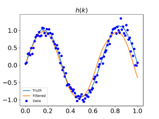
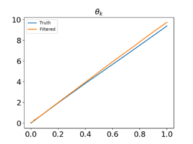

# Kalman-filters
Two classes for standard Kalman filter and extended Kalman filter are implemented for two benchmark problems in the file "kalman_filters.py".  

## Dependency
- numpy
- matplotlib

## Benchmark for standard Kalman filtering
The standard Kalman filter is applied to predict the state variables from a linear Gaussian process system which is composed of a evoluation model and a measurement model. The corresponding problem statement can be summarized as follows:
  

With Kalman filtering, the predictions for position, velocity and acceleration variables can be given in the following figures:
|                    Position                    |                 Velocity                     |                      Acceleration                    |
:----------------------------------------------: | :--------------------------------------------: | :----------------------------------------------------: 
    |   |   


**To use standard Kalman filtering, run**
```
python example1.py
```

## Benchmark for extended Kalman filtering
The extended Kalman filter is used to predict the state variables from a nonlinear Gaussian process system which is composed of a linear evoluation model and a nonlinear measurement model. The corresponding problem statement is given as follows:
  

With extended Kalman filtering, the predictions for model parameters trajectories can be given in the following figures:
|                    *h*                    |                 $\theta$                     |  
:----------------------------------------------: | :--------------------------------------------:
                   |   |
|                    $\omega$                     |                 $\alpha$                     |  
    |   |

**To use extended Kalman filtering, run**
```
python example2.py
```
